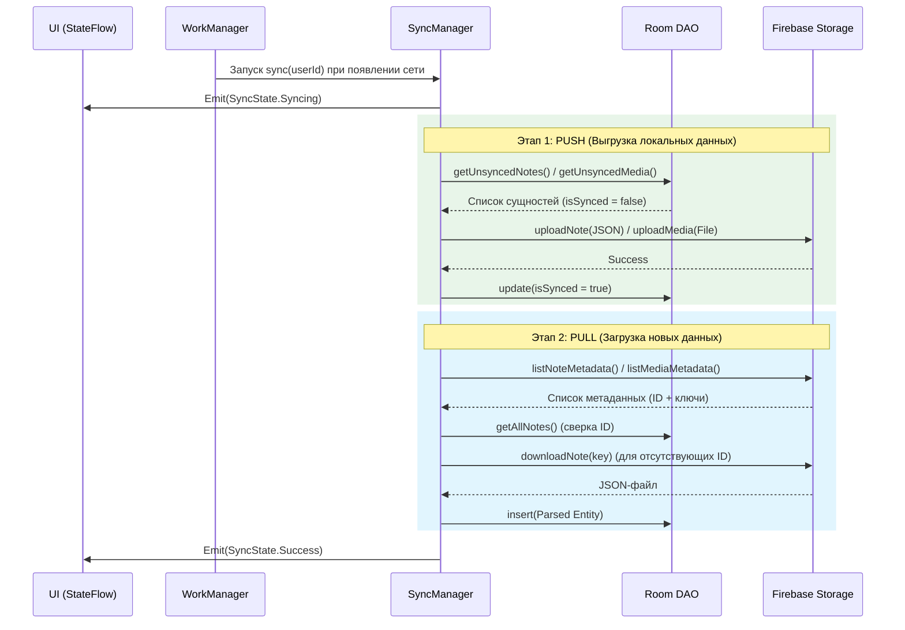

# Модуль облачной синхронизации

Приложение использует подход **Offline-First**. Это значит, что локальная база данных (Room) всегда является единым источником истины (Single Source of Truth). Пользователь может создавать, редактировать и удалять заметки без интернета, а за отправку данных в облако отвечает независимый модуль синхронизации.

Вместо использования сложных NoSQL-решений (например, Firestore), весь бэкенд построен исключительно на **Firebase Storage**. Текстовые данные конвертируются в JSON-документы, а изображения сохраняются как бинарные файлы.

---

### 🔄 Процесс синхронизации (Sequence Diagram)

Логика синхронизации строго разделена на два этапа: сначала в облако отправляются локальные изменения (`Push`), а затем скачиваются новые файлы из облака (`Pull`).

###📂 Структура хранения в Firebase
Для обеспечения изоляции данных, файлы каждого пользователя хранятся в защищенной директории, привязанной к уникальному userId (получаемому через Firebase Auth).

Внутри директории пользователя данные делятся на две папки:

users/{userId}/notes/{noteId}
Сюда загружаются текстовые данные заметок. Перед выгрузкой объект из Room сериализуется в JSON-строку с помощью NoteEntityJsonConverter.

users/{userId}/media/{noteId}_{mediaId}
Сюда загружаются прикрепленные изображения и файлы.

Важно: Имя файла в облаке формируется по шаблону noteId_mediaId. Это хитрое архитектурное решение позволяет модулю синхронизации при скачивании файла (Pull) сразу понимать, к какой именно заметке относится скачанный медиафайл, просто распарсив его название, без необходимости обращаться к сторонним базам данных.

###🛠 Ключевые компоненты
SyncManagerImpl — Сердце синхронизации. Содержит логику сериализации/десериализации и оркеструет процессы Push и Pull.

StateFlow<SyncState> — Реактивный поток состояний (Idle, Syncing, Success, Error). UI-слой (Jetpack Compose) подписывается на этот Flow, чтобы показывать пользователю индикатор загрузки или уведомления об ошибках сети.

SyncWorker (WorkManager) — Инструмент для гарантии доставки. Задачи на синхронизацию оборачиваются в OneTimeWorkRequest с требованием NetworkType.CONNECTED. Если интернета нет, WorkManager отложит задачу и выполнит её автоматически в фоне, как только устройство подключится к Wi-Fi или сотовой сети.

FirebaseCloudDataSource — Слой абстракции (Gateway) над Firebase SDK. Обертывает коллбеки Firebase в безопасные Kotlin-корутины и возвращает типизированный класс Result<T>. Устанавливает лимит размера одной текстовой заметки в 5 MB для защиты от переполнения памяти.